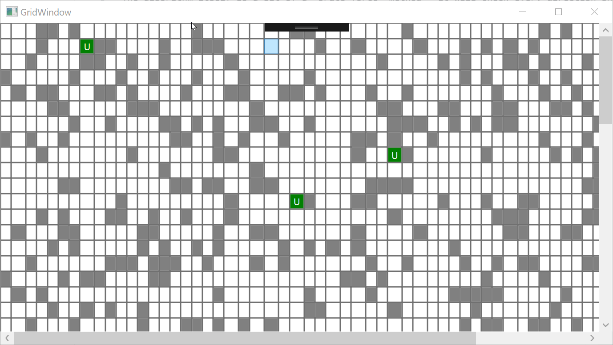

# Pathfinding
## A C# WPF pathfinding application
This is a little side project I worked on over the course of 2 days. It consists of a grid with tiles (moveable/immoveable) and units. Clicking on a unit prompts the user to enter which tile they wish to move to, at which point the pathfinding algorithm comes into play.

The algorithm itself is a bit of a "brute force" method - it will check every direction and eventually find the desired tile. It currently lacks direction (which will be implemented later on) but otherwise works correctly.

The project uses an object-oriented approach, with the main "game" consisting of a 2D array of "GridSpace" objects. It was designed from the ground up to be easily extended in future work.

